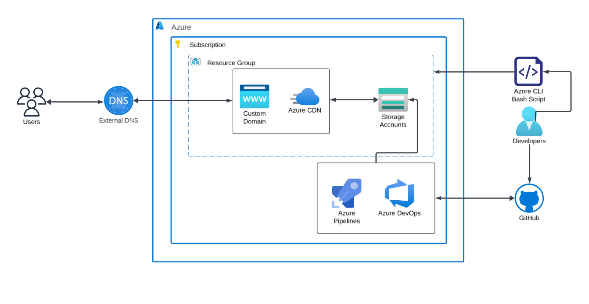

# AzureCloudopsChallenge

Hello Everyone, I am participating in [10 weeks of CloudOps Challenge](https://github.com/piyushsachdeva/10weeksofcloudops/blob/main/README.md) by [Piyush Sachdeva](https://www.linkedin.com/in/piyush-sachdeva/) and here is my challenge for the First week

## Static Website Hosting on Azure and implement CICD

I wrote about my challenges and improvements made in this [blog post](blog.mmuyideen.xyz).

